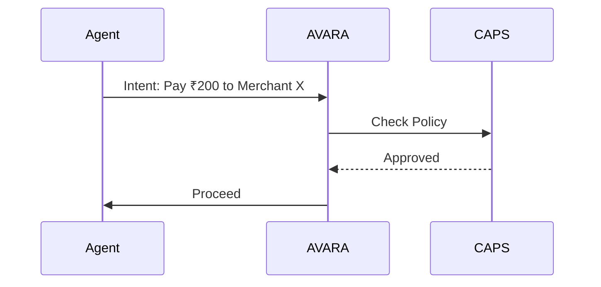

# AVARA (Autonomous Validation & Agent Risk Authority)

AVARA is a **runtime security layer** that enforces intent, permissions, provenance, and safety at execution time, not training time.

## Core Features
- **Intent Validation**: Verifies that the agent's action aligns with the user's original goal.
- **Circuit Breakers**: Automatically halts agent loops if anomalous behavior is detected.
- **Audit Ledger**: Immutable record of every decision and tool call.

## Integration
AVARA acts as a shim between the Agent Framework (LangChain/CrewAI) and the World.

See also: [[CAPS]] for the payment implementation.
