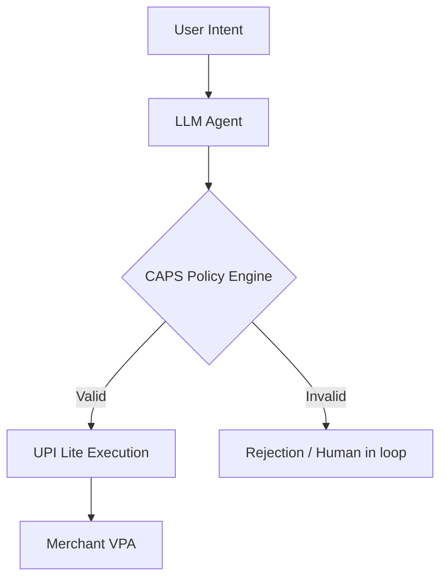

# CAPS (Context-Aware Agentic Payment System)

CAPS is a **deterministic payment kernel** designed for autonomous agents. It decouples reasoning (LLMs) from execution (UPI Lite) using policy-based safety gates.

## The Problem
AI agents in 2026 are increasingly autonomous but lack a safe way to handle money. Giving an LLM direct access to a bank account is a catastrophic security risk.

## The Solution
CAPS treats the LLM as an **untrusted intent source**. 
1. The LLM expresses a desire to pay.
2. The CAPS **Policy Engine** intercepts the request.
3. The request is validated against deterministic rules (e.g., max ₹500/txn, merchant reputation).
4. Execution happens via **UPI Lite Google ADK**.

## Tech Stack
- **Reasoning**: Ollama (Local) / Gemini
- **Safety**: Python-based Deterministic Guardrails
- **Payment**: UPI Lite / Google Pay ADK
- **Monitoring**: Real-time Fraud Intelligence Loop

[[AVARA]] provides the runtime governance for the agents using CAPS.
