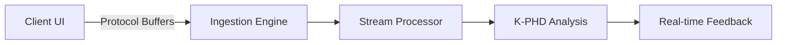

# Floework (Real-time Behavioral Telemetry)

Floework is a distributed tracing system designed to capture and analyze **human interaction sequences** in real-time.

## The Objective
Standard APM (Application Performance Monitoring) tracks CPU and Memory. Floework tracks **Flow**. 
- Where does the user hesitate?
- Which interaction sequence leads to a "Predictive Hang"?

## Integration
Floework hooks into the UI event loop and streams high-fidelity telemetry to a Go-based ingestion engine.

Related: [[K-PHD]] uses Floework signals to predict kernel-level stalls.
