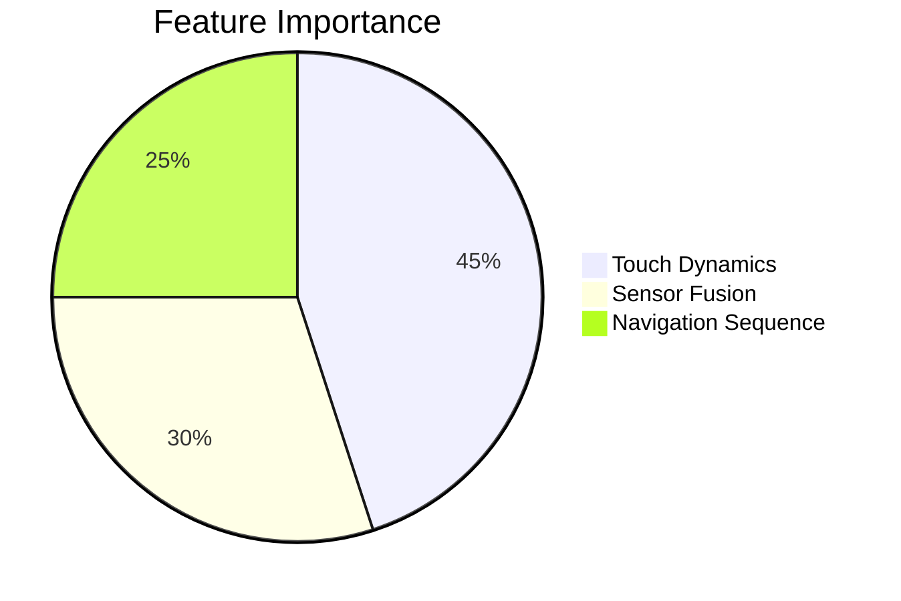

# SHIELD (Adaptive Fraud Detection)

SHIELD is a behavioral biometrics engine that identifies users based on how they interact with their devices, rather than what they know or have.

## Key Vectors
- **Touch Dynamics**: Pressure, area, and curvature of swipes.
- **Sensor Fusion**: Accelerometer and Gyroscope patterns during interaction.
- **Sequence Analysis**: The order and timing of menu navigation.

## Performance
SHIELD achieves a **99.2% Accuracy** in identifying unauthorized session takeovers by analyzing the first 5 seconds of interaction.

See also: [[CAPS]] uses SHIELD scores to authorize high-value transactions.
