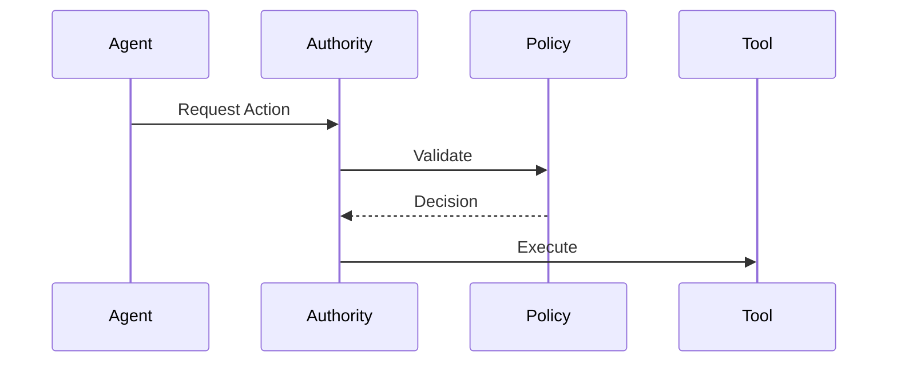

# Agent Runtime Authority

A system that sits between agents and the external world, controlling all actions.

Core Features

* Interception of actions
* Permission enforcement
* Risk evaluation

Integration

Implemented in:

* [[AVARA]]
    Connected to:
* [[runtime-governance]]
* [[intent-validation]]

See also

* [[tool-execution-guard]]
* [[circuit-breaker-pattern]]
