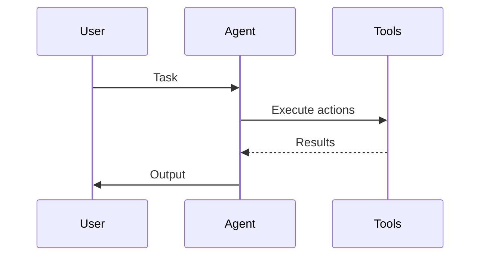

# Agent Systems

Agent systems are architectures where autonomous entities perceive, decide, and act.

Core Features

* Autonomy: Agents operate without constant human control
* Decision Loops: Observe → Reason → Act
* Tool Usage: Interact with external systems

Integration

Agent systems typically sit above infrastructure and interact via tools and APIs.

See also

* [[autonomous-agents]]
* [[tool-augmented-agents]]
* [[multi-agent-systems]]
