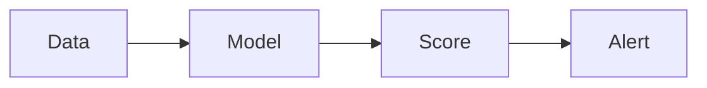

# Anomaly Detection (Security)

Identifies unusual behavior in systems.

Core Features

* Pattern deviation
* Behavior monitoring
* Risk scoring

Integration

Used in:

* [[behavioral-biometrics]]
* [[audit-ledger]]

See also

* [[agent-overreach]]
