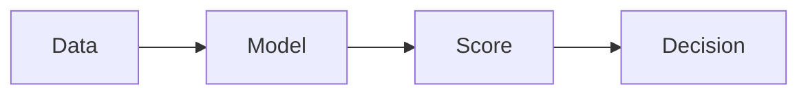

# Anomaly Detection

Anomaly detection identifies behavior that deviates from learned norms.

Core Features

* Baseline modeling
* Deviation scoring
* Threshold-based decisions

Why it matters

Used to detect:

* fraud
* attacks
* system failures

Integration

Used in:

* [[anomaly-detection-security]]
* [[behavioral-biometrics]]

See also

* [[statistical-learning]]
* [[signal-vs-noise]]
