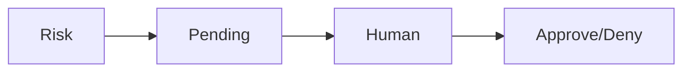

# Approval Workflows

High-risk actions require explicit approval before execution.

Core Features

* Manual approval
* Escalation paths
* Decision tracking

Integration

Used with:

* [[circuit-breaker-pattern]]
* [[policy-engine]]

See also

* [[consent-token]]
