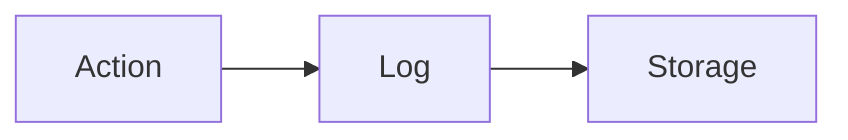

# Audit Ledger

Records every action and decision in a system.

Core Features

* Immutable logs
* Traceability
* Replay capability

Why it matters

Enables:

* debugging
* compliance
* forensic analysis

Integration

Used in:

* [[agent-runtime-authority]]
* [[policy-engine]]

See also

* [[anomaly-detection-security]]
