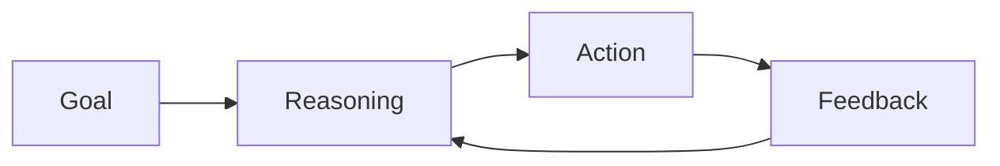

# Autonomous Agents

Autonomous agents operate independently to complete tasks over time.

Core Features

* Goal-driven behavior
* State persistence
* Iterative reasoning

Risks

* Unbounded execution
* Goal drift
* Resource misuse

Integration

Used in:

* [[agent-systems]]
* [[multi-agent-systems]]

See also

* [[agent-overreach]]
* [[reasoning-vs-execution]]
