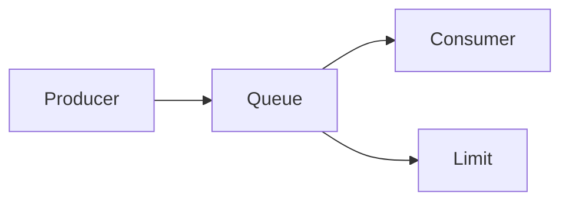

# Backpressure

Controls the rate of incoming requests to prevent overload.

Core Features

* flow control
* load regulation
* system stability

Integration

Used in:

* [[async-systems]]
* [[event-driven-architecture]]

See also

* [[failure-cascades]]
