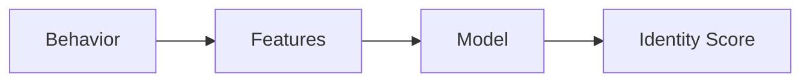

# Behavioral Biometrics

Users are identified by how they behave, not what they know.

Core Features

* typing patterns
* touch dynamics
* navigation behavior

Why it matters

Prevents:

* SIM swap fraud
* account takeover
* bot attacks

Integration

Core to:

* [[anomaly-detection]]
* [[session-risk-scoring]]

See also

* [[feature-engineering]]
