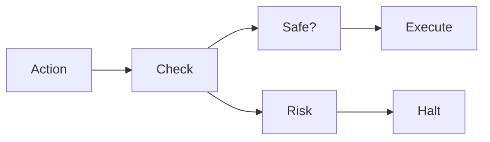

# Circuit Breaker Pattern

Stops execution when risk exceeds acceptable thresholds.

Core Features

* Automatic halting
* Threshold-based triggers
* Recovery mechanisms

Integration

Used in:

* [[agent-runtime-authority]]
* [[event-driven-architecture]]

See also

* [[approval-workflows]]
* [[agent-overreach]]
