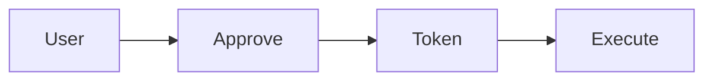

# Consent Token

A token representing user-approved actions.

Core Features

* Scoped permissions
* Single-use
* Time-bound validity

Integration

Used in:

* [[policy-engine]]
* [[approval-workflows]]

See also

* [[agent-identity-iam]]
