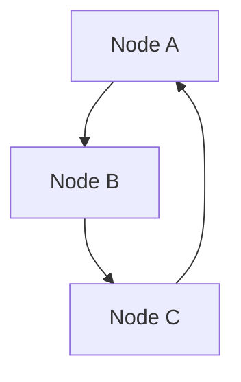

# Distributed Systems

A distributed system consists of multiple nodes working together to achieve a common goal.

Core Features

* Partial failure
* Network communication
* Scalability

Challenges

* consistency
* latency
* fault tolerance

Integration

Foundation for:

* [[multi-agent-systems]]
* [[event-driven-architecture]]

See also

* [[failure-cascades]]
* [[observability]]
