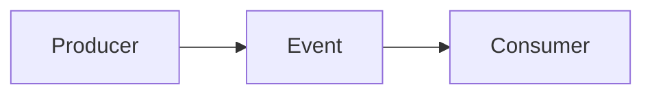

# Event Driven Architecture

Components communicate via events instead of direct calls.

Core Features

* Loose coupling
* Asynchronous execution
* Scalability

Integration

Used in:

* [[distributed-systems]]
* [[circuit-breaker-pattern]]

See also

* [[async-systems]]
* [[backpressure]]
