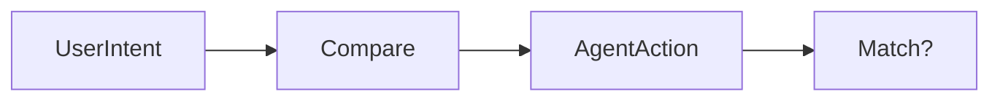

# Intent Validation

Validates that an agent’s action matches the original user goal.

Core Features

* Semantic comparison
* Drift detection
* Instruction consistency

Risks addressed

* [[prompt-injection]]
* [[agent-overreach]]

Integration

Used in:

* [[agent-runtime-authority]]
* [[policy-engine]]

See also

* [[rag-security]]
* [[approval-workflows]]
