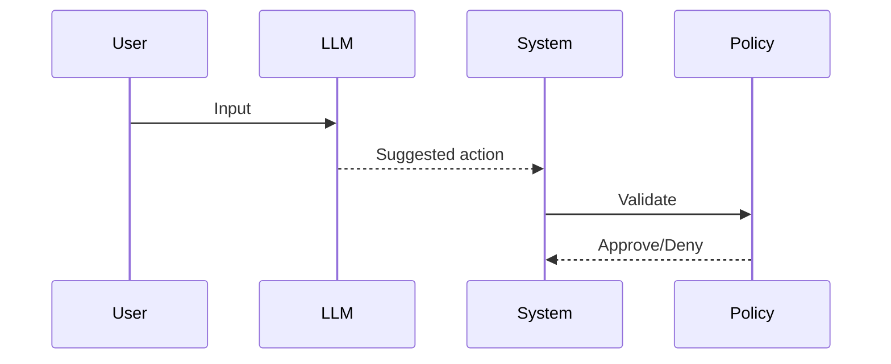

# LLM as Untrusted Component

LLMs generate outputs probabilistically and must not be trusted with execution authority.

Core Features

* Non-deterministic outputs
* Prompt sensitivity
* No inherent safety guarantees

Principle

LLM = Suggestion engine, not decision engine

Integration

Used in:

* [[reasoning-vs-execution]]
* [[prompt-injection]]

See also

* [[agent-overreach]]
* [[rag-systems]]
