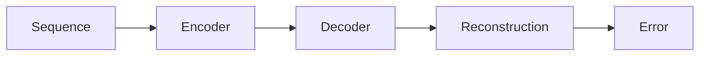

# LSTM Autoencoder

Models sequential data and detects anomalies via reconstruction error.

Core Features

* sequence learning
* reconstruction error
* temporal modeling

Integration

Used in:

* [[time-series-modeling]]
* [[anomaly-detection]]

See also

* [[dynamical-systems]]
