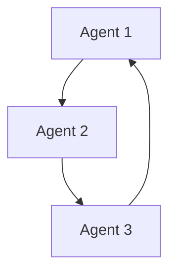

# Multi-Agent Systems

Multiple agents collaborate or compete to solve tasks.

Core Features

* Agent-to-agent communication
* Distributed reasoning
* Emergent behavior

Risks

* Coordination failure
* Cascading errors
* Assumption propagation

Integration

Built on:

* [[agent-systems]]
* [[autonomous-agents]]

See also

* [[agent-overreach]]
* [[reasoning-vs-execution]]
