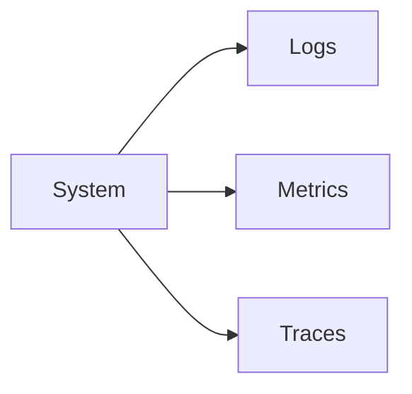

# Observability

Observability enables insight into system behavior.

Core Features

* Logs
* Metrics
* Traces

Why it matters

* debugging
* performance monitoring
* anomaly detection

Integration

Used in:

* [[audit-ledger]]
* [[anomaly-detection-security]]

See also

* [[failure-cascades]]
