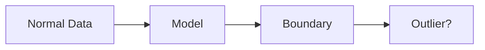

# One-Class SVM

Learns the boundary of normal data and flags outliers.

Core Features

* unsupervised learning
* boundary detection
* anomaly scoring

Integration

Used in:

* [[anomaly-detection]]
* [[behavioral-biometrics]]

See also

* [[statistical-learning]]
