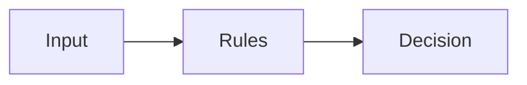

# Policy Engine

Policy Engine

A rule-based system that decides whether actions are allowed.

Core Features

* Deterministic evaluation
* Rule enforcement
* Risk scoring

Integration

Core to:

* [[runtime-governance]]
* [[reasoning-vs-execution]]

See also

* [[consent-token]]
* [[circuit-breaker-pattern]]
