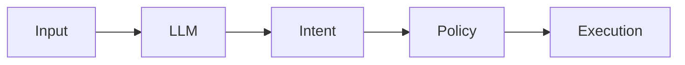

# Reasoning vs Execution

AI systems must separate reasoning from execution.

Core Features

* Reasoning Layer: LLM interprets intent
* Execution Layer: Deterministic system acts

Why it matters

Prevents:

* hallucinated actions
* unsafe execution
* agent misuse

Integration

Core to:

* [[llm-as-untrusted-component]]
* [[agent-systems]]

See also

* [[agent-overreach]]
* [[prompt-injection]]
