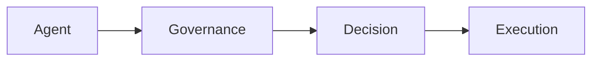

# Runtime Governance

Runtime governance ensures that AI systems are controlled while they act, not just during design.

Core Features

* Execution-time enforcement
* Continuous validation
* Real-time intervention

Why it matters

Static rules fail because:

* agents evolve behavior
* context changes dynamically
* threats are adaptive

Integration

Critical for:

* [[agent-systems]]
* [[autonomous-agents]]

See also

* [[agent-runtime-authority]]
* [[policy-engine]]
