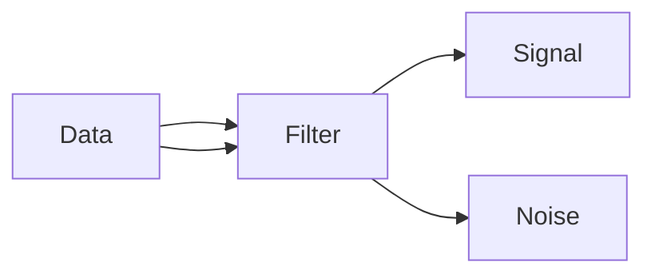

# Signal vs Noise

Not all data is meaningful. Systems must extract signal from noise.

Core Features

* pattern detection
* filtering
* statistical significance

Integration

Used in:

* [[feature-engineering]]
* [[statistical-learning]]

See also

* [[anomaly-detection]]
