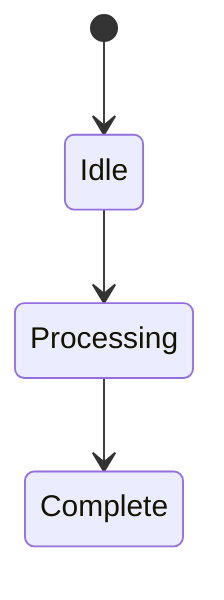

# State Machines

Systems transition between predefined states based on inputs.

Core Features

* deterministic transitions
* predictable behavior
* explicit states

Integration

Used in:

* [[policy-engine]]
* [[approval-workflows]]

See also

* [[control-plane-vs-data-plane]]
