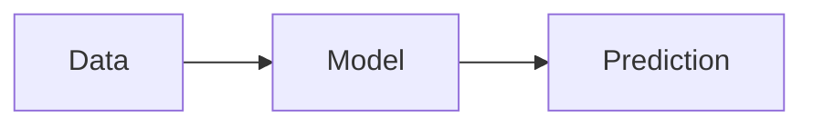

# Statistical Learning

Models learn distributions and patterns from data.

Core Features

* probability distributions
* inference
* generalization

Integration

Used in:

* [[one-class-svm]]
* [[anomaly-detection]]

See also

* [[signal-vs-noise]]
