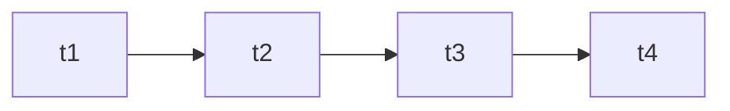

# Time Series Modeling

Behavior changes over time and must be modeled sequentially.

Core Features

* temporal dependencies
* sequence patterns
* trend analysis

Integration

Used in:

* [[lstm-autoencoder]]
* [[anomaly-detection]]

See also

* [[dynamical-systems]]
