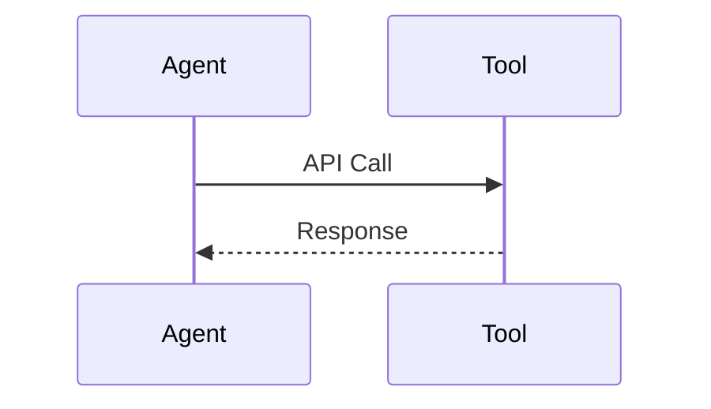

# Tool-Augmented Agents

Agents extend capabilities by using tools like APIs, databases, and services.

Core Features

* External tool access
* Dynamic execution
* Context-aware actions

Risks

* Unauthorized tool usage
* Data leakage
* Execution abuse

Integration

Used in:

* [[agent-systems]]
* [[rag-systems]]

See also

* [[prompt-injection]]
* [[agent-overreach]]
