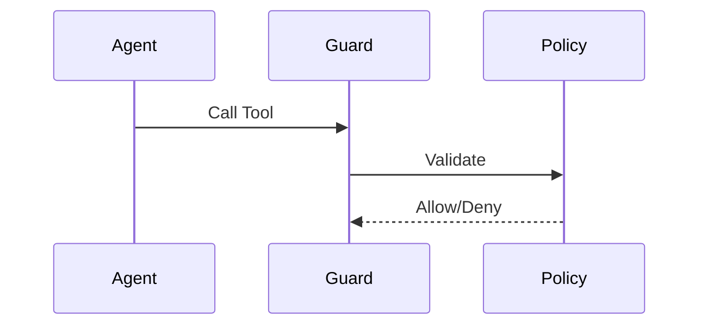

# Tool Execution Guard

Ensures only approved tools are executed with valid permissions.

Core Features

* Tool registration
* Permission checks
* Execution validation

Integration

Used in:

* [[agent-runtime-authority]]
* [[tool-augmented-agents]]

See also

* [[prompt-injection]]
* [[agent-overreach]]
